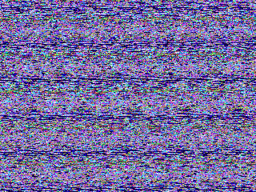
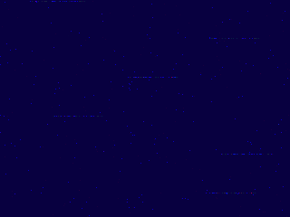
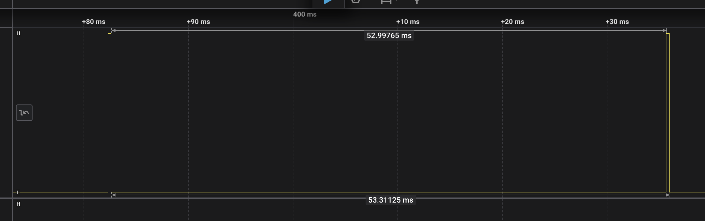
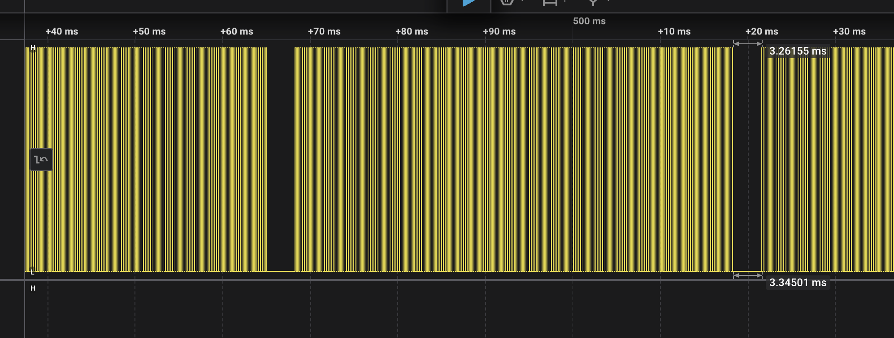
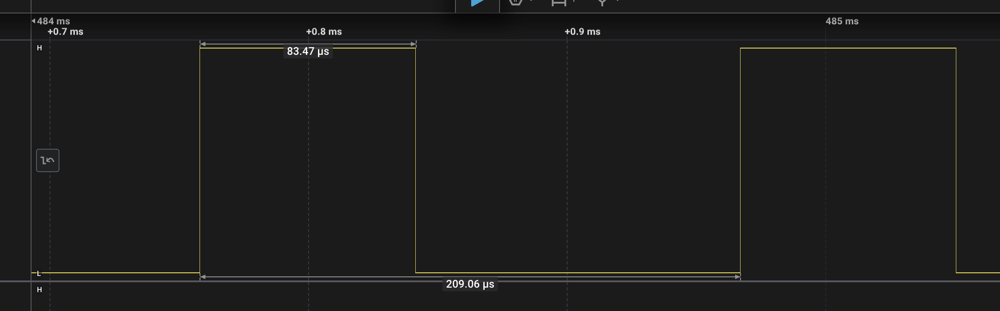
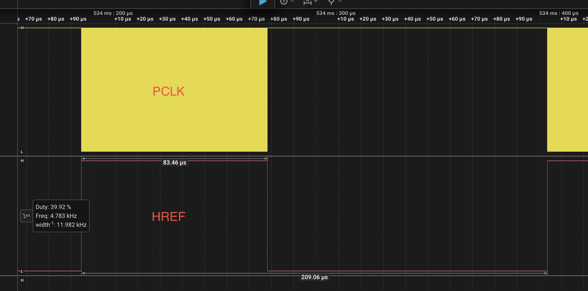
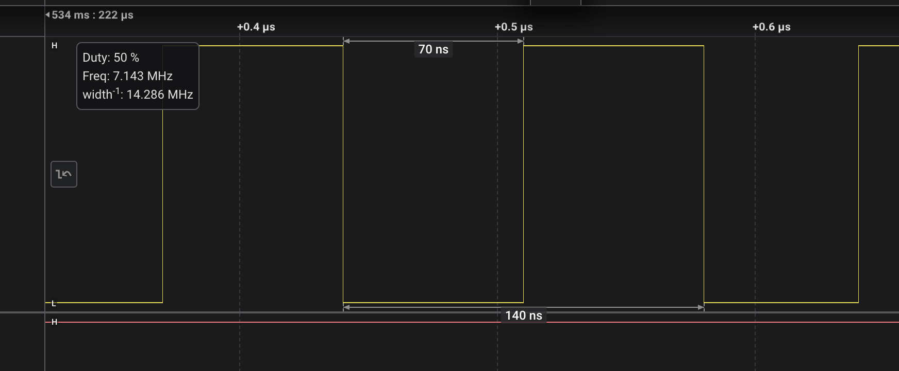

# Frame Grabber for Pico 2 OV7670 Adapter

This is a frame grabber for capturing QVGA (320 x 420) RGB56 images and sending them over UART. The serial data is parsed by a Python program on the computer and a PNG RGB image created.

### UART Pins

UART_TX_PIN GP16
UART_RX_PIN GP17

## Current Status 

Output is garbled.



Output with lenscap:




## OV7670 Setup

The OV7670 registers are set to QVGA RGB565. I2C is verified to be working. Changing reg values is changing signal output.

### Signals from Logic Analyzer

The signals from OV7670 are consistent with QVGA (320 x 240) RGB565 - 2 PCLK pulses per pixel.

I am supplying XCLK at 15 MHz. Hence PCLK is at about 75 MHz.

**VSYNC**

Here's VSYNC. It's the same for VGA, QVGA, etc. Timing is correct.



**HREF**

Here's HREF. 






From the above, 50.17 ms/(209.07 us) = 239.96 - ie, 240 is the number of rows, or height of the image. 

**PCLK**

Here's PCLK and HREF together.



Here's PCLK by itself.




From the above, 83.46 us/ 130 ns = 642. So 640 is the image width. At 2 x PCLKs per pixels, it's consistent with 2 * 320 = 640.

## Data Pins

On the PCBs, OV7670 D7..D0 are connected to GP6...GP13.

So,keeping GP6 as BASE pin in PIO, means that our data byte will be flipped in bits. This is corrected per byte before transmitting via UART.

## PIO

The PIO below does the following:

1. Read width (2 * 320 - 1 = 639) from TX FIFO.
2. Read OSR value into X register.
3. Wait for HREF to go high.
4. Wait for PCLK to go high.
5. Read in 8 pins GP6-GP13 to ISR. SM is set to auto-push from ISR to RX FIFO.
6. Loop till x-- is 0 (post-decr, hence N-1)

```
.program ov7670_qvga_565

    pull block    ; wait for width from OSR which comes from TX FIFO via auto-push
    wait 1 pin 2  ; Wait for VSYNC high (GP2 - Start of new frame)
    wait 0 pin 2  ; Wait for VSYNC low

.wrap_target
    mov x, OSR    ; move from OSR to X
    wait 1 pin 3  ; Wait for HREF high (GP3 - Row start)

pixel_loop:
    wait 1 pin 4  ; Wait for PCLK rising edge (GP4 - Pixel clock)
    in pins, 8    ; Read 8-bit pixel data from GP0-GP7
    wait 0 pin 4  ; Wait for PCLK falling edge
    jmp x-- pixel_loop  ; Continue while X not 0

    wait 0 pin 3  ; Wait for HREF low 
.wrap
```

## DMA 

The DMA is set up as follows:

1. 32 bit data transfer.
2. src is RX FIFO.
3. dst is uint8_t* buffer.
4. Data length is 2 * 320 * 240 / 4 bytes

I have tested the PIO + DMA by removing OV7670, setting D7-D0 using wires to the bit pattern 0xCB and it was received via UART on the PC correctly.

## Data Format

On PCLK, 8 bits GP6-GP13 are right-shifted into the 32-bit ISR, and after 4 PCLKs, ISR is auto-pushed to the RX FIFO which looks like:

|GP13...GP6|GP13...GP6|GP13...GP6|GP13...GP6|

This is copied by DMA to uint8_t* buffer and the write address incremented.

So the bytes end up in uint8_t* buffer as:

[0] GP13...GP6
[1] GP13...GP6
[2] GP13...GP6
[3] GP13...GP6

Before UART transmission, each byte is reversed - so we have:

[0] GP6...GP13
[1] GP6...GP13
[2] GP6...GP13
[3] GP6...GP13

Which is same as:

[0] D7...D0
[1] D7...D0
[2] D7...D0
[3] D7...D0

Which is correct. [0] and [1] are the RGB565 values for a pixel split across two bytes.

## Development Plan 

1. [+] Send a PWM to XCLK and check href, vsync, pclk signals.
2. [+] Hook up I2C and set output to 320 x 240 - check signals for correctness
3. [+] Write PIO code.
3. [+] Set up DMA to transfer to buffer.
4. [+] UART code to send buffer.
5. [+] Python code on PC to read from serial and display image data 

## Equivalent PIO of Sandeep's code

https://github.com/ArmDeveloperEcosystem/hm01b0-library-for-pico/blob/main/src/hm01b0.c#L149

```
.program camera_capture
    pull        block      ; Pull OSR value into PIO
    wait 0 pin vsync_pin  ; Wait for VSYNC to go low
    wait 1 pin vsync_pin  ; Wait for VSYNC to go high
    set y, num_border_px-1

border_y_loop:
    wait 1 pin hsync_pin  ; Wait for HSYNC to go high
    wait 0 pin hsync_pin  ; Wait for HSYNC to go low
    jmp  y--, border_y_loop

.wrap_target
    mov x, osr            ; Load OSR into X register
frame_loop:
    wait 1 pin hsync_pin  ; Wait for HSYNC to go high
    set y, num_border_px * num_pclk_per_px - 1

border_x_loop:
    wait 1 pin pclk_pin   ; Wait for PCLK to go high
    wait 0 pin pclk_pin   ; Wait for PCLK to go low
    jmp  y--, border_x_loop

pixel_loop:
    wait 1 pin pclk_pin   ; Wait for PCLK to go high
    in   pins, data_bits  ; Read pixel data
    wait 0 pin pclk_pin   ; Wait for PCLK to go low
    jmp  x--, pixel_loop  ; Loop for pixel read

    wait 0 pin hsync_pin  ; Wait for HSYNC to go low
.wrap
```

